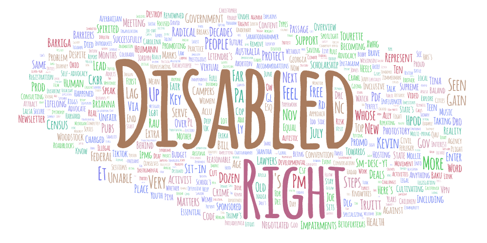
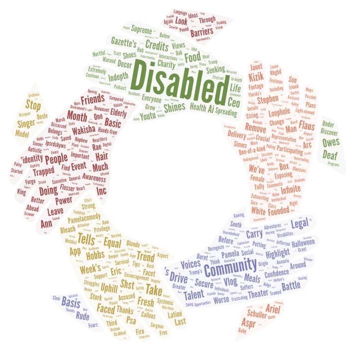
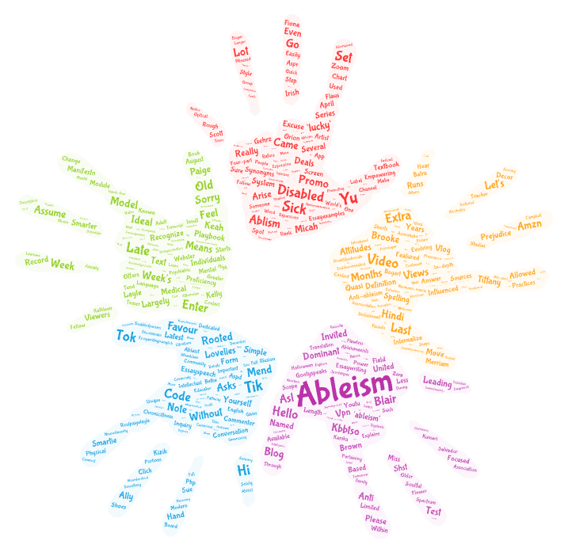

## YouTube Keyword Analysis - Exploring Disability

For this lab, I chose to explore about how disability is discussed on YouTube by collecting video data using these three search terms:

- disability rights
- disabled community
- ableism definition

I chose this topic because I currently takeing another course that focuses on (dis)ability, and I wanted to see how public conversations on YouTube reflects various perspectives on disability. Each of the three terms highlights a slightly different angle: rights and activism, identity and belonging, and how bias gets explained or challenged.

### What I noticed from the word clouds

The word cloud for *disability rights* includes "government," "people," "advocacy," "support," and "barriers." It leaned toward policy and legal language, which makes sense given the search term.

*Disabled community* brought up words like "awareness," "friends," "voices," and "event." This one felt more personal and social, with a lot of emphasis on connection and visibility.

*Ableism definition* was more scattered. I saw words like "assume," "attitudes," "views," "dominant," and "prejudice." It seemed to pull in educational content, but also reactions and commentary.

### Possible reasons for these patterns

I think the search terms affect the searching results a lot. When searching "disability rights", organizations and advocacy groups were more likely to be brought up. "Disabled community" related videos are likely to be created by creators and vloggers, while “ableism definition” brings up videos that try to explain or unpack the concept, sometimes in casual or unexpected ways.

### What I’d do differently next time

If I had more time, I would like to explore more terms and dive deeper into the topic. It might be interesting to include video transcripts or captions if possible so I could analyze the actual language used. Comparing results across different regions or time periods could be fun too.

### Something stand out to me

One thing that stood out to me was that all three word clouds included at least some positive or community‑oriented words, even though the search terms themselves pointed in different directions. I expected “ableism definition” to be more academic, but it turns out including personal stories and even humor. "Disabled community" and "disability rights" both have a lot of social and relational terms, as those are the hints of community, support, and visibility.

### Download the Data
[Download disability_rights.csv](assets/disability_rights.csv)

[Download disabled_community.csv](assets/disabled_community.csv)

[Download ableism_definition.csv](assets/ableism_definition.csv)
